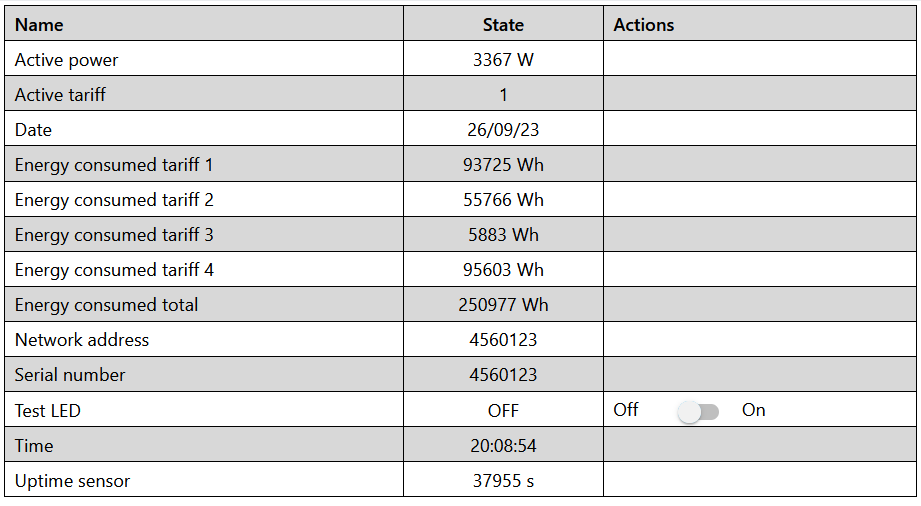
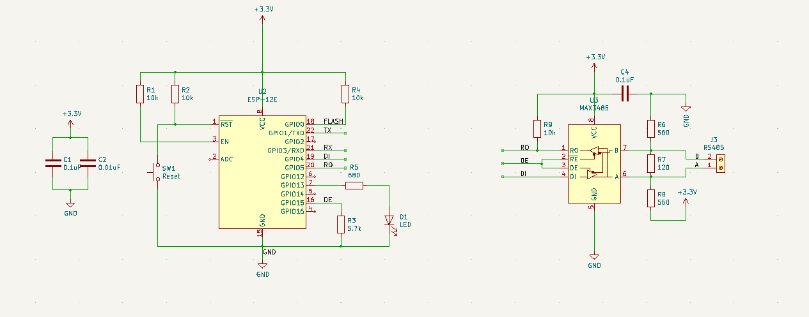

# ESPHome компонент для подключения счетчиков электроэнергии СПбЗиП ЦЭ 2727А и ЦЭ 2726А по RS-485
https://github.com/latonita/esphome-ce2727a-meter/

## Подключение

Компонент предполагает использование ESP8266 или ESP32 с RS-485 трансивером.
Подключение счетчика к трансиверу по одной витой паре.
Подключение микроконтроллера к трансиверу трехпроводное: 
``RO`` - прием, 
``DI`` - передача, 
``DE + R̅E̅``  - контроль линии для передачи данных.
Я в 2018 сделал свою [плату на базе ESP8266 и MAX3485](https://github.com/latonita/kicad-various-shematics/tree/master/esp8266-rs485-box-70x70) под стандартную распаечную коробку из магазина, но подходит и любой китайский модуль RS458<->TTL.
```
+-------+                    +-------------+              +----------------+
|       |                    |             |              |                |
|  MCU  | RX <----------< RO | RS485<->TTL | A <------> A | Электросчетчик |
|       |             ,-> R̅E̅ |             |              |                |
| ESPxx | FLOW >-----+       |   module    | B <------> B |    ЦЭ2726А     |
|       |             `-> DE |             |              |    ЦЭ2727А     |
|       | TX >----------> DI |             |              |                |
+-------+                    +-------------+              +----------------+
```
Принципиальная схема простейшей обвязки для ESP8266 и MAX3485 [указана ниже](#пример-обвязки-микроконтроллера-esp8266).

### Особенности
1. UART0 использовать нельзя - ESPHOME его использует для логирования.

2. Для esp8266 в ESPHOME используется SoftwareSerial и можно использовать любые пины для RX/TX. 

3. Для ESP32 нужно использовать UART2: RX=16, TX=17.

4. Параметры подключения к счетчику: 9600 8E1.

5. Компонент расчитан на работу с одним электросчетчиком и использует широковещательные пакеты.
Если на одной линии подключено больше одного счетчика - необходимо в yaml файле указать сетевой адрес счетчика. Сетевой адрес по-умолчанию совпадает с заводским номером (указан на фронтальной панели счетчика и не включает год выпуска). 
```
ce2727a:
    address: 4560123
```
6. Примеры конфигураций в файлах [`example.ce2727-8266.yaml`](example.ce2727-8266.yaml) и [`example.ce2727-32.yaml`](example.ce2727-32.yaml). Секреты - из вашего стандартного файла `secrets.yaml`.

## Получаемые данные
Компонент получает базовые данные со счетчика:
- Информацию о счетчике
- Время/дата
- Текущая суммарная активная мощность
- Текущий тариф
- Накопленная энергия по тарифам


## Пример обвязки микроконтроллера esp8266

Общий вид готового модуля: 


## Связанные проекты и ссылки
- [Драйвер ESP-IDF для электросчетчика ЦЭ2727А/ЦЭ2726А](https://github.com/latonita/ce2727a-driver)
- [Простой эмулятор электросчетчика ЦЭ2727А/ЦЭ2726А для разработки](https://github.com/latonita/ce2727a-emulator-js)
- [Kicad схема модуля ESP8266 RS-485](https://github.com/latonita/kicad-various-shematics/tree/master/esp8266-rs485-box-70x70)

